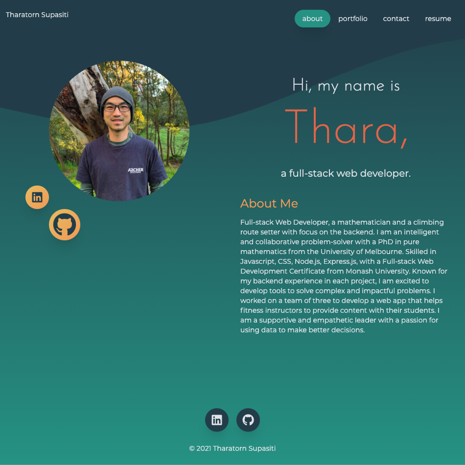

# portfolio

## <h2 id="description"> Description </h2>

A personal portfolio website written in React and tailwindcss. The final application is deployed on GitHub Pages.

It is a single page website that allows visitor to navigate between 'pages' by the anchor tag on the navigation bar. It is designed based on mobile-first principle. It has the following main sections:
- About me: that tells the visitor about my background;
- Portfolio: that has a list of projects I have been involved in;
- Contact: that has allows any user to contact me. It is only a mock up contact me. No email is sent when the form is submitted. The form will validate any user input before submitting the form. 
- Resume: that lists my skills and allow any visitor to download my cv.

### <h3 id="preview"> Preview </h3>

The end product should resemble the mock-up provided below:

## <h2 id="table-of-contents"> Table of Contents </h2>

- [Description](#description)
- [Installation](#installation)
- [Usage](#usage)
- [License](#license)

## <h2 id="installation"> Installation </h2>
[(Back to top)](#table-of-content)

If you would like to work on a copy of this web application, first clone the repo to your device using the commands below:

    git clone https://github.com/Supasiti/portfolio.git

Then install all the required libraries by running the follow command

    npm i 

and add any additional development dependencies:

    npm i -D

## <h2 id="usage"> Usage </h2>
[(Back to top)](#table-of-content)

The main application is deployed in GitHub Pages, [here](https://supasiti.github.io/portfolio) 

## <h2 id="license"> License </h2>
[(Back to top)](#table-of-content)

Licensed under the [MIT](https://opensource.org/licenses/MIT) license.